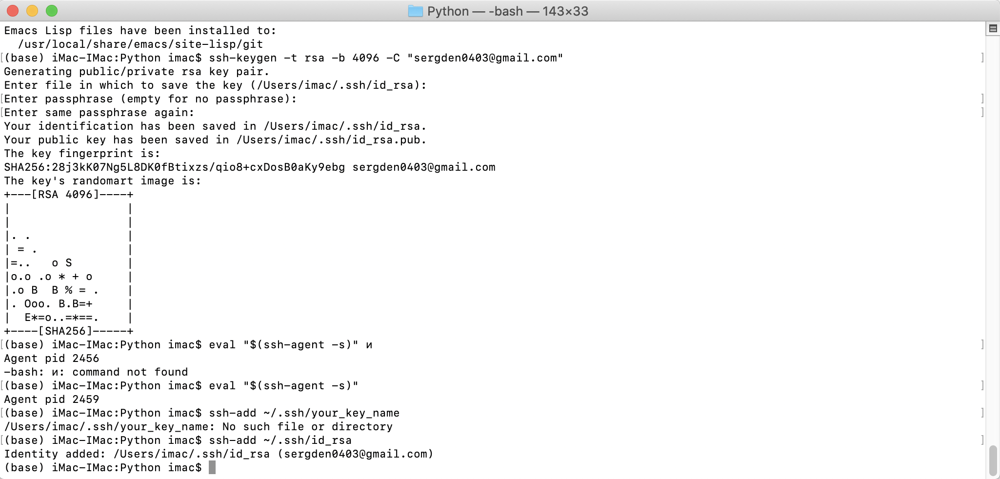

# Python programming practice 

 
<h2 align="center">Connection ssh</h2>

 

 
Screenshots of program execution are shown below.

 
<h2 align="center">Task 1</h2>

 
<h2 align="center">Task 2</h2>

